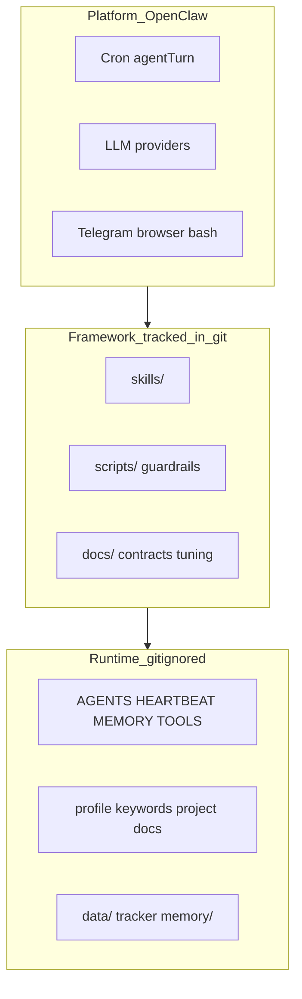
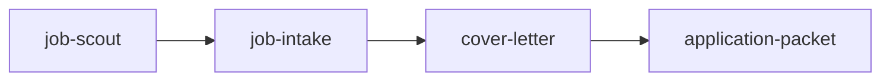

# OpenClaw Job Hunting Framework

Skills-based job-hunting workflow that runs on the OpenClaw agent harness (migrated from Hermes). This workspace is a **framework + runtime instance**, not a standalone pip-installable agent library.

## Three Layers

| Layer | What it is | Version control |
|-------|------------|-----------------|
| **Platform** | OpenClaw gateway, cron, model routing, channels | `~/.openclaw/openclaw.json`, `~/.openclaw/cron/jobs.json` |
| **Framework** | Skills, guardrail scripts, tuning YAML, report contracts | This git repo (framework paths only) |
| **Runtime instance** | Harvey agent bootstrap, candidate profile, tracker, daily logs | Local files; gitignored |

## Skill Graph

Primary pipeline:

Cross-cutting skills:

- **pipeline** — status updates, follow-ups, recommendation feedback, tracker queries
- **candidate-materials** — CV/profile refresh, canonical project facts
- **pdf** — PDF extraction and manipulation helpers

Handoffs are convention-based: each skill documents inputs, outputs, and CLI calls. OpenClaw loads skills into the agent system prompt; the agent selects skills by task description and follows the runbook.

## LLM vs Script Division

The repo contains **no LLM API calls**. Models run only when OpenClaw executes an agent turn.

| Step | Executor | Notes |
|------|----------|-------|
| Preflight / wake gate | `scripts/job_scouting_preflight.py` | Pure Python; runs before agent |
| Tuning / keyword load | `scripts/job_scout_tuning.py`, `scripts/search_keywords.py` | Config loaders |
| Job search, page reading | **LLM agent** + browser/bash tools | LinkedIn, ATS pages, search engines |
| JD signal extraction | **LLM agent** | Structured JSON: stack levels, seniority, travel, etc. |
| `technical_score` (35% weight) | **LLM agent** | Agent-assessed; passed into scorer |
| Final score and save gates | `scripts/score_lead.py` | Deterministic rules on agent signals |
| Tracker read/write | `scripts/tracker_ops.py` | Excel workbook; runtime data |
| Daily Telegram report | **LLM agent** | Follows `docs/report_contract.md` |
| Cover letter / Fit Matrix | **LLM agent** via `cover-letter` skill | Prose generation |
| NL pipeline updates | **LLM agent** via `pipeline` skill | "Rejected by Acme" → tracker update |

Design principle: **config and deterministic gates before LLM judgment**.

## OpenClaw Wiring

Minimum platform setup:

1. **Agent** — register workspace and skills in `openclaw.json` (`agents.list[].workspace`, `agents.list[].skills`).
2. **Cron** — daily scouting via `payload.kind: agentTurn` in `~/.openclaw/cron/jobs.json`; launcher references `cron-prompts/daily-job-scouting.example.txt` (copy to a live prompt with your workspace path).
3. **Runtime bootstrap** — create locally (gitignored): `AGENTS.md`, `HEARTBEAT.md`, `MEMORY.md`, `TOOLS.md`, `SOUL.md`, `IDENTITY.md`, `USER.md`.
4. **Candidate overlay** — create locally (gitignored): `docs/profile.md`, `docs/agent_job_search_keywords.json`, `docs/target_companies.md`, project narratives under `docs/`.

See [docs/openclaw_setup.md](docs/openclaw_setup.md) for install and cron wiring.

## Repository Boundaries

**Tracked (framework):** `skills/`, `scripts/`, `tests/`, framework docs, `docs/job_scout_tuning.yaml`, `cron-prompts/*.example.txt`.

**Ignored (runtime / personal):** bootstrap markdown, candidate docs, `data/`, tracker xlsx, attachments, `memory/`, secrets.

To fork this framework for another candidate: clone or copy the tracked paths, then add your own runtime overlay without committing private data.

## Known Gaps

- `skills/cover-letter` and `skills/application-packet` reference `scripts/pdf_ops.py`, which is not yet in `scripts/`. PDF rendering may use the `pdf` skill or external tools until that script is added.
