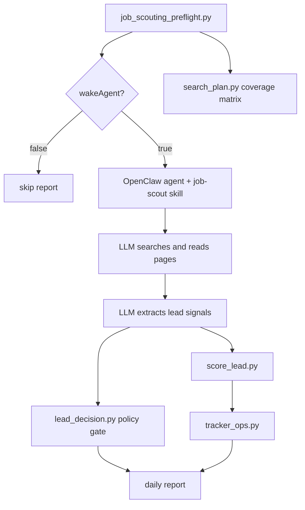

# OpenClaw Job Hunting Framework

A skills-based job scouting framework for OpenClaw and similar agent harnesses.

This repository is both a practical daily-use job-search workflow and an
engineering case study for agent workflow design. It shows how to coordinate
LLM reasoning, deterministic scripts, tool use, reusable skills, private runtime
state, and human approval boundaries in one production-shaped workflow.

It is not an auto-apply bot. It is not a crawler. It is a concrete example of
how to design a reliable LLM-assisted workflow around a noisy real-world task.

Public repo: [github.com/SJFWey/openclaw-job-hunting-framework](https://github.com/SJFWey/openclaw-job-hunting-framework)

## What This Demonstrates

The framework is built around one central design question:

> In an agentic workflow, what should be handled by deterministic code, what
> should be delegated to an LLM, what should be encoded as reusable skills, and
> what must remain a human decision?

The job-search domain makes those boundaries visible:

- **Scripts** handle repeatable gates: preflight checks, query budgets, search
  coverage planning, source/freshness policy, scoring, deduplication, and
  tracker operations.
- **LLMs** handle semantic work: reading job descriptions, extracting signals,
  assessing technical fit, synthesizing search results, and writing reports or
  application drafts.
- **Skills** act as reusable runbooks: they define context loading, tool use,
  handoff contracts, and safety rules.
- **Humans** approve external consequences: applications, messages, durable
  memory updates, and final prioritization.

For the full narrative, read [CASE_STUDY.md](CASE_STUDY.md).

## System Shape

The project is split into three layers:

- **Platform:** OpenClaw or a similar agent harness supplies model routing,
  cron turns, tools, and delivery channels.
- **Framework:** this repository supplies skills, deterministic scripts,
  tests, tuning defaults, and public workflow contracts.
- **Runtime overlay:** candidate profile, keyword pack, tracker, daily memory,
  CV, and generated materials stay local and gitignored.

This separation is the core portability boundary: the framework can be public,
while the same workspace remains useful for private daily job search.

## Daily Job Scouting Flow

Scheduled scouting is an agent turn, not a standalone scraping job.



The search planner is now the default daily coverage baseline. The lead decision
policy is the default save gate before a recommendation is written to the
tracker.

## Key Components

| Path | Role |
|------|------|
| `skills/job-scout/` | Scouting runbook: broad candidate pool, validation queue, scoring, reporting |
| `scripts/job_scouting_preflight.py` | Runtime health, tracker snapshot, wake gate, daily context |
| `scripts/search_plan.py` | Default exploration matrix across clusters, sources, locations, freshness |
| `scripts/score_lead.py` | Deterministic dimension scoring and hard gates |
| `scripts/lead_decision.py` | Source/freshness/manual-check policy gate |
| `scripts/tracker_ops.py` | Excel-backed applications and recommendations tracker |
| `docs/job_scout_tuning.yaml` | Query budgets, coverage targets, freshness, source policy, scoring config |
| `docs/report_contract.md` | Required daily report structure |
| `CASE_STUDY.md` | Public system-design case study |

## Search Strategy

The framework deliberately separates search breadth from final recommendation
quality.

1. Build a broad candidate pool from a coverage matrix:
   role cluster, priority, source family, location band, freshness intent, and
   validation intent.
2. Let the LLM perform web search, page reading, and semantic extraction.
3. Validate only the most promising leads with full job-description evidence.
4. Keep blocked, login-gated, snippet-only, or aggregate-only sources in the
   Manual-check queue unless a public full-JD source is found.
5. Save only leads that pass dedupe, source confidence, freshness, hard gates,
   and score thresholds.

The goal is not to maximize saved rows. The daily-use quality metric is whether
the recommendations become more actionable and more often accepted.

## Quickstart

```bash
python3 -m venv .venv
source .venv/bin/activate
pip install -e ".[yaml]"
python3 -m unittest discover -s tests
```

Run the daily preflight in dry-run mode:

```bash
python3 scripts/job_scouting_preflight.py --dry-run
```

Inspect the daily search plan:

```bash
python3 scripts/search_plan.py --execution-notes
python3 scripts/search_plan.py --date 2026-05-31 --json
```

Score and policy-check a synthetic lead:

```bash
python3 scripts/score_lead.py \
  --signals-file tests/fixtures/signals/python_cv_secondary_cpp.json \
  --json

python3 scripts/lead_decision.py \
  --signals-file tests/fixtures/signals/python_cv_secondary_cpp.json \
  --json
```

## Runtime Setup

Prerequisites:

- Python 3.11+
- OpenClaw gateway and an agent workspace binding
- An OpenClaw model provider
- Optional YAML support via `pip install -e ".[yaml]"`

OpenClaw wiring is documented in [docs/openclaw_setup.md](docs/openclaw_setup.md).
At runtime, create a local overlay with candidate profile, keyword pack,
tracker workbook, and bootstrap files. These files are intentionally gitignored.

## Repository Boundaries

Tracked in git:

- skills and runbooks,
- deterministic scripts,
- framework documentation,
- synthetic fixtures and tests,
- tuning defaults and report contracts.

Kept local and ignored:

- CV and candidate profile,
- tracker workbook,
- daily memory,
- generated application materials,
- secrets and OpenClaw runtime state.

This separation lets the repo be a reusable public case study while the same
workspace remains useful for real daily job search.

## Safety Model

Allowed by the workflow:

- scout and summarize opportunities,
- score and deduplicate leads,
- save validated recommendations,
- prepare application materials,
- propose memory or preference updates.

Requires explicit human approval:

- submitting applications,
- sending external messages,
- changing durable memory from inferred preferences,
- submitting a lead that the policy gate keeps in Manual-check.

Not supported:

- bypassing anti-bot systems,
- circumventing login walls,
- scraping restricted data,
- auto-applying to jobs.

## Development

Run all tests:

```bash
python3 -m unittest discover -s tests
```

Useful smoke checks:

```bash
python3 scripts/job_scout_tuning.py
python3 scripts/search_plan.py --execution-notes
python3 scripts/job_scouting_preflight.py --dry-run
```

## Further Reading

- [CASE_STUDY.md](CASE_STUDY.md) - engineering case study and design rationale
- [FRAMEWORK.md](FRAMEWORK.md) - layer model and LLM/script/human boundary table
- [docs/architecture.md](docs/architecture.md) - component overview
- [docs/report_contract.md](docs/report_contract.md) - daily report contract
- [docs/feedback_loop.md](docs/feedback_loop.md) - feedback and memory policy
- [docs/openclaw_setup.md](docs/openclaw_setup.md) - runtime setup

## License

MIT. See [LICENSE](LICENSE).
