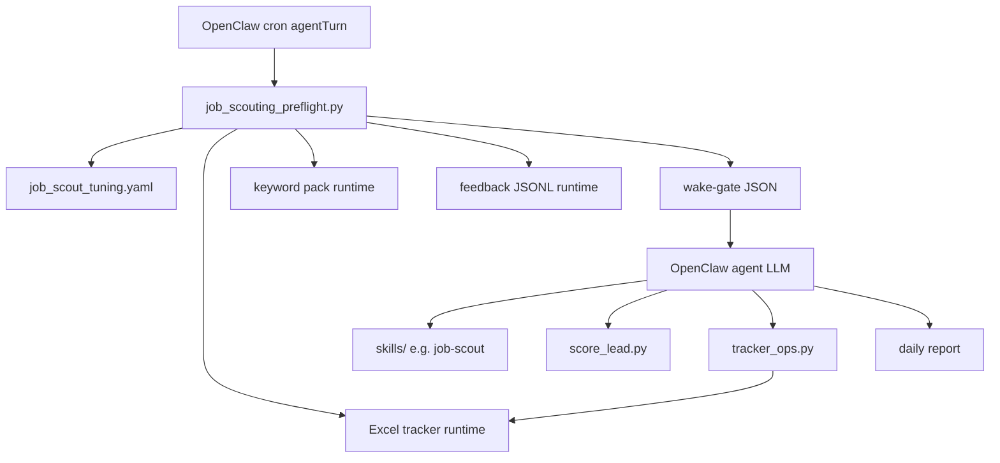

# Architecture

This workspace is an **OpenClaw Job Hunting Framework** instance: skills define agent workflows; Python scripts provide deterministic guardrails; the LLM runs only inside OpenClaw agent turns (see [FRAMEWORK.md](../FRAMEWORK.md)).

## Layers

| Layer | Location | In git |
|-------|----------|--------|
| Platform | `~/.openclaw/openclaw.json`, cron jobs | No |
| Framework | `skills/`, `scripts/`, framework `docs/` | Yes |
| Runtime | bootstrap MD, profile, tracker, `data/` | No |

## Components

### Skills

Seven skills under `skills/` orchestrate the agent runbooks: `job-scout`, `job-intake`, `cover-letter`, `application-packet`, `pipeline`, `candidate-materials`, `pdf`. OpenClaw injects them into the agent prompt; selection is by skill description and user/cron intent.

### Tuning Config

`docs/job_scout_tuning.yaml` is the primary control surface: preset, query budget, P0/P1/P2 mix, target-company count, freshness, validation depth, source policy, scoring thresholds, feedback behavior.

### Preflight

`scripts/job_scouting_preflight.py` runs **before** the LLM agent. It prints runtime health, tuning profile, tracker validation, daily run plan, recent feedback, recent recommendations, and a final JSON wake-gate line. The last non-empty stdout line is always JSON for the harness.

### Scoring

`scripts/score_lead.py` is deterministic. The agent extracts structured signals from JDs (LLM); the script applies fixed weights, location tiers, seniority penalties, stack gates, and save recommendations.

### Tracker

`scripts/tracker_ops.py` manages applications, recommendations, and follow-ups in an Excel workbook under `data/`. Runtime data; not tracked in git.

### Feedback

Append-only JSONL at `data/job_scout_feedback.jsonl`. Preflight summarizes recent patterns; the agent proposes `MEMORY.md` updates after repeated evidence—never auto-writes durable memory.

## Design Principles

- Config before prompt changes.
- Deterministic gates before LLM judgment.
- Separate validated recommendations from manual-check queues.
- Keep private candidate data in the runtime layer (gitignored).
- Never auto-submit applications.
